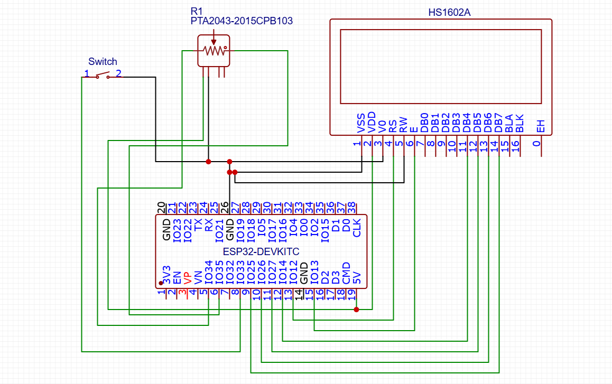

## Dual-Slider-LED-Blinker

A small PlatformIO project for ESP32 that reads two slide potentiometers (sliders) and blinks an LED (or LEDs) accordingly. This repository contains the firmware source in `src/main.cpp` and supporting PlatformIO configuration in `platformio.ini`.

---

## Circuit diagram

The circuit diagram / photo is included below. If you don't see the image, make sure `circuit-diagram.png` (or your diagram) is present at the project root.



---

## Features
- Read two slide potentiometers (ADC)
- Map slider values to LED blink patterns or brightness
- Built using PlatformIO for ESP32

## Hardware
- ESP32 development board
- 2x slide potentiometers (connected to ADC-capable pins)
- 1 or more LEDs (with current-limiting resistors)
- Breadboard and jumper wires

Suggested wiring (example):
- Slider 1: Vcc (3.3V), GND, middle pin -> GPIO (ADC) e.g. 34
- Slider 2: Vcc (3.3V), GND, middle pin -> GPIO (ADC) e.g. 35
- LED: GPIO e.g. 2 -> resistor -> LED -> GND

Adjust pins to match the code in `src/main.cpp`.

## Build & upload (Windows)
1. Install PlatformIO (recommended: VS Code + PlatformIO extension) or use the PlatformIO Core CLI.
2. Open the project folder in VS Code.
3. Build and upload using the PlatformIO toolbar or run in a terminal:

```cmd
platformio run --target upload
```

If you have multiple environments in `platformio.ini`, set the environment with `-e <env>`.

## Troubleshooting
- If upload fails, check the selected COM port and that the ESP32 is in flash mode (some boards require holding `BOOT` while pressing `EN`/`RST` or PlatformIO handles it automatically).
- Verify wiring and ADC pins if slider readings look incorrect.

## Files of note
- `platformio.ini` - PlatformIO configuration
- `src/main.cpp` - Firmware source

## Contribution
Feel free to open issues or PRs. Small improvements: add calibration for slider inputs, support for PWM LED brightness, or add a web/serial UI to display slider values.

## License
Add a license of your choice (MIT recommended) or state that the project is for learning/hobby use.
